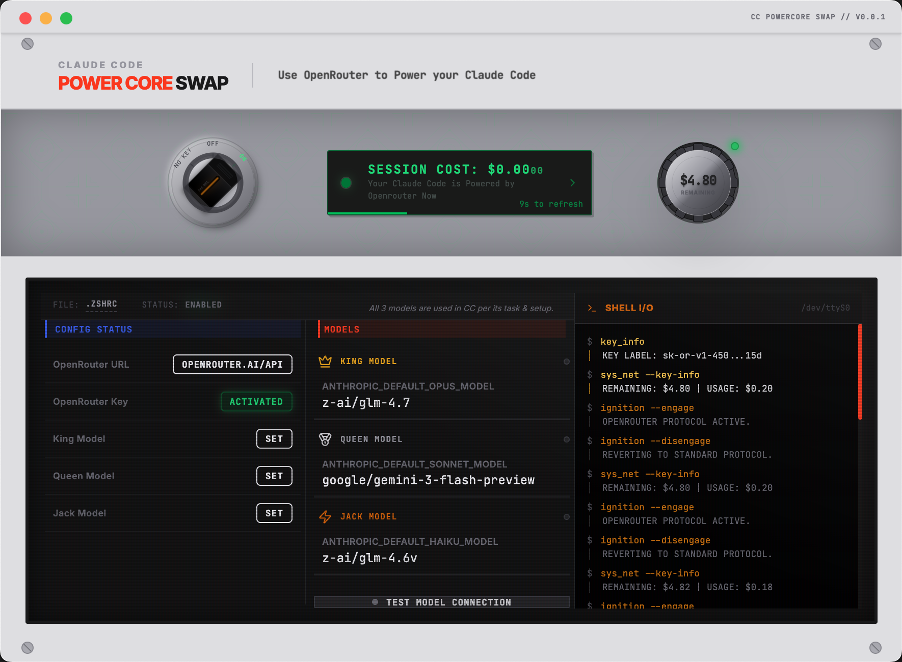

# CC PowerCore


-lightgrey.svg)


**CC PowerCore** 是一个 [Claude Code](https://docs.anthropic.com/en/docs/agents-and-tools/claude-code/overview) 桌面应用，将 CLI 流量路由到 [OpenRouter](https://openrouter.ai/)，让你可以控制模型选择、预算和 API 使用。



---

## 功能

CC PowerCore 让你可以在官方 Claude Code CLI 中使用 **OpenRouter 支持的任意模型**。它将 OpenRouter 配置注入到 Shell 环境，无需手动编辑配置文件即可切换模型。

## 适用人群

- 想在 Claude Code 中使用 Gemini、Codex、Z.AI 等模型的开发者
- 需要实时监控会话成本的用户
- 偏好图形界面而非手动编辑配置文件的人

## 特性

- **模型配置**：设置 King (Opus)、Queen (Sonnet)、Jack (Haiku) 三个模型槽位，支持任意 OpenRouter 模型
- **成本追踪**：实时监控会话成本
- **路由开关**：一键开启/关闭 OpenRouter 路由
- **预算显示**：查看剩余余额和使用状态
- **Shell 集成**：自动配置 `.zshrc` 或 `.bashrc`

## 安装

### 下载

- **macOS (Apple Silicon)**: [从 Releases 下载](https://github.com/stabruriss/cc-power-core/releases/latest)

### 安装

1. 下载 DMG
2. 拖动 CCPowerCore 到 Applications
3. 首次启动时右键选择"打开"（未签名应用需要此步骤）

### 设置

1. 从 [OpenRouter](https://openrouter.ai/keys) 获取 API Key
2. 启动 CC PowerCore
3. 输入 API Key
4. 配置首选模型
5. 将开关转到 "ON"
6. 启动**新的** Claude Code 会话（见下方使用提示）

## 使用提示

> **重要**：开启/关闭路由后，必须启动新的 Claude Code 会话才能生效。环境变量只在新会话启动时读取。

### 终端 (CLI)

- 输入 `exit` 结束当前会话，然后重新运行 `claude`
- 或打开新的终端窗口/标签页

### IDE 集成

Claude Code 的 IDE 插件（VS Code、Windfurf、Cursor 等）不会读取 Shell 环境变量。如需在 IDE 中使用 CC PowerCore，请在集成终端中运行 CLI，而不是使用原生插件。

## 工作原理

CC PowerCore 在 Shell 配置文件（`.zshrc` 或 `.bashrc`）中添加环境变量：

```bash
# CCPowerCore Start
export ANTHROPIC_BASE_URL="https://openrouter.ai/api"
export ANTHROPIC_AUTH_TOKEN="sk-or-..."
export ANTHROPIC_DEFAULT_OPUS_MODEL="anthropic/claude-3-opus"
export ANTHROPIC_DEFAULT_SONNET_MODEL="anthropic/claude-sonnet-4"
export ANTHROPIC_DEFAULT_HAIKU_MODEL="anthropic/claude-3-haiku"
# CCPowerCore End
```

关闭路由时，这些配置会被移除。

## 开发

### 要求

- Node.js 18+
- npm 或 yarn

### 设置

```bash
git clone https://github.com/stabruriss/cc-power-core.git
cd cc-power-core
npm install
npm run dev      # 开发模式
npm run build    # 生产构建
```

### 结构

```
cc-power-core/
├── electron/           # 主进程
│   ├── main.ts
│   ├── preload.ts
│   └── shellUtils.ts
├── src/                # React 前端
│   ├── components/
│   ├── lib/
│   └── App.tsx
├── public/
└── release/            # 构建产物 (gitignored)
```

## 许可证

MIT License - 见 [LICENSE](LICENSE)

## 致谢

- [Claude Code](https://docs.anthropic.com/en/docs/agents-and-tools/claude-code/overview) by Anthropic
- [OpenRouter](https://openrouter.ai/)
- [Electron](https://www.electronjs.org/)
